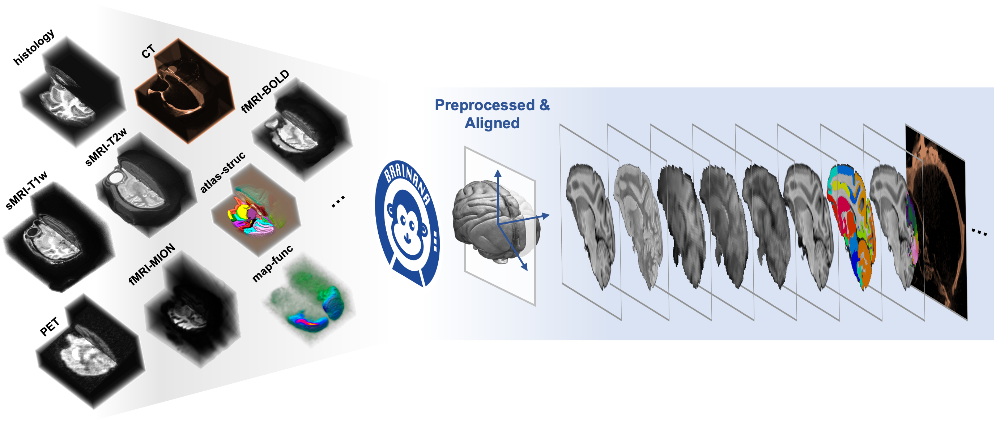
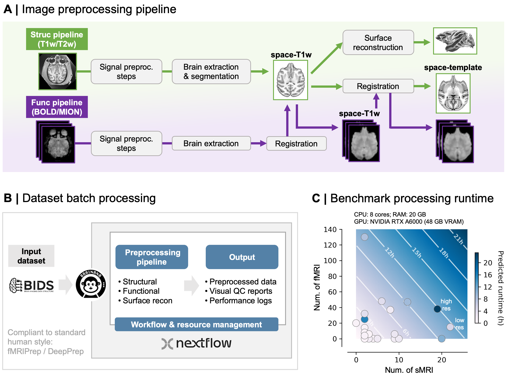

:og:description: Brainana is an end-to-end macaque (non-human primate) MRI preprocessing pipeline: anatomical and functional (fMRI) preprocessing, registration, and surface reconstruction from BIDS data, reproducible with Docker and Nextflow.

.. meta::
   :description: Brainana is an end-to-end macaque (non-human primate) MRI preprocessing pipeline: anatomical and functional (fMRI) preprocessing, registration, and surface reconstruction from BIDS data, reproducible with Docker and Nextflow.
   :keywords: macaque MRI preprocessing, NHP neuroimaging, non-human primate fMRI, BIDS, surface reconstruction, ANTs, FreeSurfer, Nextflow

Brainana
========

About
^^^^^

|

**Brainana** is a unified, end-to-end preprocessing framework for **macaque (non-human primate) MRI**. It provides anatomical and functional preprocessing, registration, tissue segmentation, and cortical surface reconstruction from BIDS data — reproducible with Docker and Nextflow, built on FSL, ANTs, AFNI, FreeSurfer, and FastSurfer.

|

License
^^^^^^^
Copyright (c) the Brainana Developers. 
Licensed under the GNU Affero General Public License v3 (AGPL-3.0).

Citation
^^^^^^^^
`Brainana: an end-to-end preprocessing framework for macaque neuroimaging <https://www.biorxiv.org/content/10.64898/2026.06.03.729972v1.abstract>`_

Contents
--------

.. toctree::
   :maxdepth: 1
   :caption: INSTALLATION

   installation

.. toctree::
   :maxdepth: 1
   :caption: USER GUIDE

   usage_notes

.. toctree::
   :maxdepth: 1
   :caption: BRAINANA LITE

   brainana_lite

.. toctree::
   :maxdepth: 1
   :caption: PROCESS AND OUTPUTS

   processing
   outputs
   anat_selection_for_func
   spaces_and_transforms

.. toctree::
   :maxdepth: 1
   :caption: TEMPLATE AND ATLAS

   template_atlas_zoo

.. toctree::
   :maxdepth: 1
   :caption: OTHER INFO

   faq
