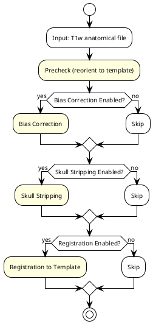
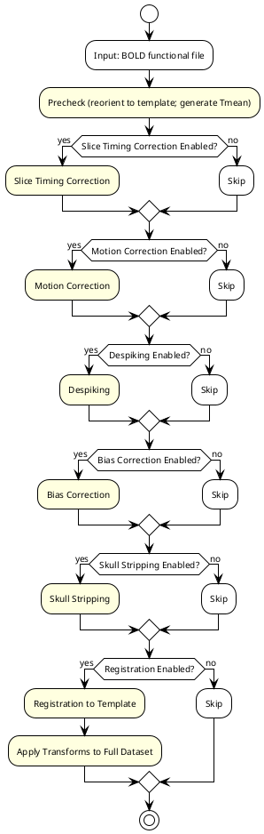
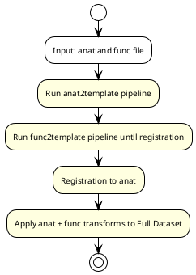
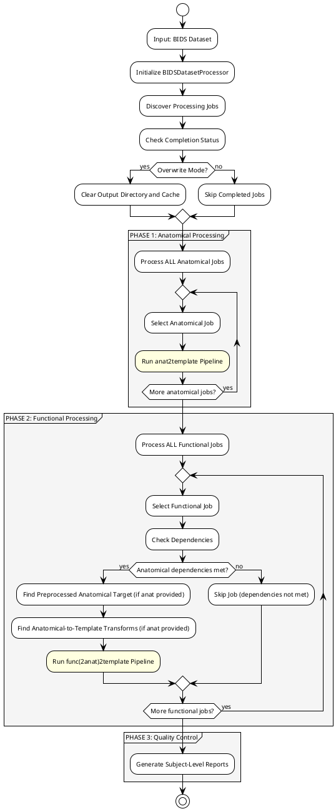

# banana Pipeline Flowcharts

This document provides flowcharts showing the processing steps for each of the main preprocessing pipelines in banana.

**Note**: The project now uses Nextflow for orchestration. These flowcharts show the step-by-step processing logic, which is implemented as Nextflow modules calling step functions. See `README_NEXTFLOW.md` for usage instructions.

## Pipeline Overview

banana supports preprocessing pipelines orchestrated through Nextflow:

1. **anat2template**: Anatomical data processing and registration to template space
2. **func2template**: Functional data processing and direct registration to template space  
3. **func2anat2template**: Functional data processing with intermediate registration to anatomical data, then to template space

## 1. anat2template Pipeline Flowchart

## 2. func2template Pipeline Flowchart

## 3. func2anat2template Pipeline Flowchart

## 4. BIDS Dataset Processing Workflow

## Pipeline Comparison Summary

| Aspect | anat2template | func2template | func2anat2template | BIDS Processing |
|--------|---------------|---------------|-------------------|-----------------|
| **Input Type** | Single T1w file | Single BOLD file | Single BOLD file | BIDS dataset (T1w + BOLD) |
| **Processing Steps** | 4 main steps | 8 main steps | 9 main steps | 3 phases (anatomical + functional + QC) |
| **Registration Strategy** | Direct to template | Direct to template | Anatomical → Template, then Functional → Anatomical → Template | Orchestrates multiple pipelines |
| **Dependencies** | None | None | Requires preprocessed anatomical | Functional depends on anatomical |
| **Parallel Processing** | Single file | Single file | Single file | Multiple subjects/sessions |
| **Caching** | Step-level | Step-level | Step-level | Job-level with resumption |
| **Quality Control** | Per-step snapshots | Per-step snapshots | Per-step snapshots | Subject-level consolidated reports |
| **Use Case** | Individual anatomical analysis | Individual functional analysis (no anatomical) | Individual functional analysis (with anatomical) | Full dataset preprocessing |

## Key Processing Features

### Optional Steps
All pipelines support configurable step enablement:
- **Bias Correction**: Reduces intensity inhomogeneity
- **Skull Stripping**: Extracts brain tissue
- **Slice Timing Correction**: Corrects acquisition timing (functional only)
- **Motion Correction**: Realigns volumes (functional only)
- **Despiking**: Removes spike artifacts (functional only)

### Registration Methods
- **anat2template**: Direct registration using ANTs (rigid + affine + nonlinear)
- **func2template**: Direct registration to template space
- **func2anat2template**: Two-stage registration (func→anat→template)

### Output Organization
- **BIDS-compliant naming**: Standardized file naming conventions
- **Space specifications**: Clear indication of output space (anatomical, template)
- **Transform files**: Forward and inverse transformation matrices
- **Derivatives structure**: Organized output directory structure 