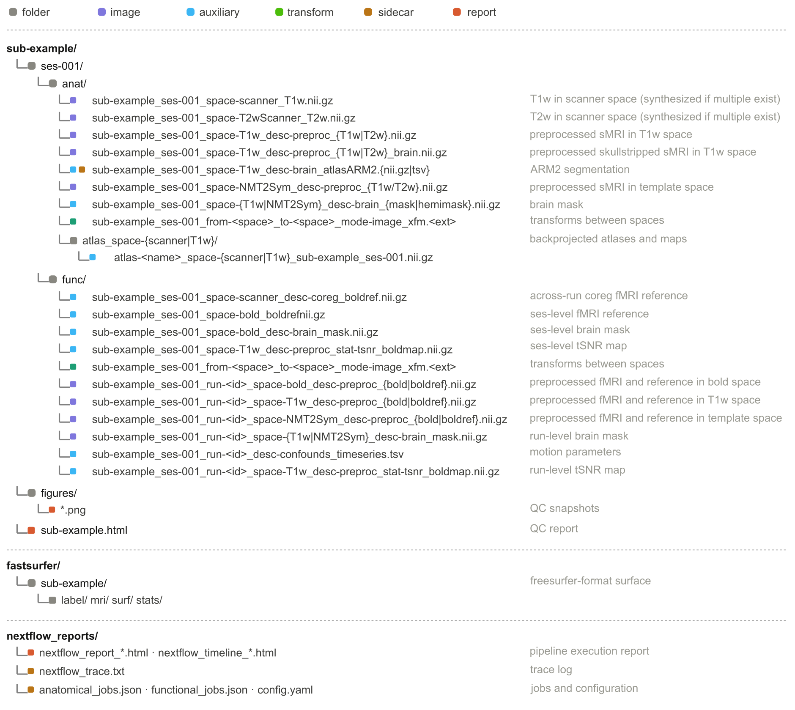

:og:description: Brainana output directory layout — the BIDS-derivatives structure and file naming for preprocessed macaque MRI anatomical and functional results.

.. meta::
   :description: Brainana output directory layout — the BIDS-derivatives structure and file naming for preprocessed macaque MRI anatomical and functional results.
   :keywords: BIDS derivatives, output layout, macaque MRI outputs, file naming, preprocessing results

Outputs
=======

Brainana writes all results under the **output directory** you specify (e.g. ``/output`` when using Docker). Outputs follow a BIDS derivatives layout.

Directory layout
----------------

|

The diagram above is the canonical layout.

Subject directory (``sub-<id>/``)
---------------------------------

Session directory (``ses-<id>/``)
^^^^^^^^^^^^^^^^^^^^^^^^^^^^^^^^^

Anatomical outputs (``anat/``)
""""""""""""""""""""""""""""""

*Scanner-space synthesis*

- ``<ses_prefix>_space-scanner_T1w.nii.gz`` — T1w in scanner space (synthesized when multiple runs exist).
- ``<ses_prefix>_space-T2wScanner_T2w.nii.gz`` — T2w in native T2w scanner space (synthesized when multiple runs exist).

*T2w in T1w scanner space* (when T2w data are present)

- ``<ses_prefix>_space-scanner_T2w.nii.gz`` — T2w registered to T1w scanner space.

*Preprocessed structural images — T1w space*

- ``<ses_prefix>_space-T1w_desc-preproc_T1w.nii.gz`` — Preprocessed T1w in T1w space.
- ``<ses_prefix>_space-T1w_desc-preproc_T1w_brain.nii.gz`` — Skull-stripped T1w in T1w space.
- ``<ses_prefix>_space-T1w_desc-preproc_T2w.nii.gz`` — Preprocessed T2w in T1w space.
- ``<ses_prefix>_space-T1w_desc-preproc_T2w_brain.nii.gz`` — Skull-stripped T2w in T1w space.
- ``<ses_prefix>_space-T1w_desc-preproc_T1wT2wCombined.nii.gz`` — T1w/T2w combined image (T2w-enhanced contrast; when T2w is available).

*Segmentation and masks — T1w space*

- ``<ses_prefix>_space-T1w_desc-brain_mask.nii.gz`` — Binary brain mask.
- ``<ses_prefix>_space-T1w_desc-brain_hemimask.nii.gz`` — Hemisphere mask.
- ``<ses_prefix>_space-T1w_desc-brain_atlasARM2.nii.gz`` — ARM2 atlas segmentation.
- ``<ses_prefix>_space-T1w_desc-brain_atlasARM2.tsv`` — Color LUT for the atlas segmentation.

*Template-space structural images*

- ``<ses_prefix>_space-<template>_desc-preproc_T1w.nii.gz`` — T1w registered to template space.
- ``<ses_prefix>_space-<template>_desc-preproc_T2w.nii.gz`` — T2w registered to template space.
- ``<ses_prefix>_space-<template>_desc-brain_mask.nii.gz`` — Brain mask in template space.

*Transform files*

- ``<ses_prefix>_from-scanner_to-T1w_mode-image_xfm.mat`` — Scanner-to-T1w conformation (FSL ``.mat``).
- ``<ses_prefix>_from-T1w_to-scanner_mode-image_xfm.mat`` — Inverse conformation.
- ``<ses_prefix>_from-T1w_to-<template>_mode-image_xfm.<ext>`` — T1w-to-template registration (ANTs ``.h5`` or fireANTS ``.nii.gz``).
- ``<ses_prefix>_from-<template>_to-T1w_mode-image_xfm.<ext>`` — Template-to-T1w inverse registration.
- ``<ses_prefix>_from-T2wScanner_to-scanner_mode-image_xfm.<ext>`` — T2wScanner-to-scanner(T1w) registration.
- ``<ses_prefix>_from-scanner_to-T2wScanner_mode-image_xfm.<ext>`` — Scanner(T1w)-to-T2wScanner registration.

*Atlas backprojection* (when registration is enabled)

Atlases are backprojected from template space into two subfolders:

- ``atlas_space-T1w/`` — ``atlas-<name>_space-T1w_<ses_prefix>.nii.gz``
- ``atlas_space-scanner/`` — ``atlas-<name>_space-scanner_<ses_prefix>.nii.gz``

Functional outputs (``func/``)
""""""""""""""""""""""""""""""

Session-level files omit task and run entities. Per-run files include them (see ``<run_prefix>`` above).

**Session-level files are produced only when within-session coregistration is enabled** (``func.coreg_runs_within_session``). When it is disabled, the session-level BOLD reference, brain mask, coreg reference, transforms, and session tSNR below are produced **per-run** instead (same naming patterns with ``<run_prefix>``).

*Session-level images* (when coreg enabled)

- ``<ses_prefix>_space-scanner_desc-coreg_boldref.nii.gz`` — Session-averaged BOLD reference after within-session coregistration (scanner space).
- ``<ses_prefix>_space-bold_boldref.nii.gz`` — BOLD reference in bold (conformed) space.
- ``<ses_prefix>_space-bold_desc-brain_mask.nii.gz`` — Brain mask in bold space.
- ``<ses_prefix>_space-T1w_desc-preproc_stat-tsnr_boldmap.nii.gz`` — Session-level temporal SNR map (T1w space; when tSNR is enabled).

*Session-level transforms* (when coreg enabled; per-run when coreg disabled)

- ``<ses_prefix>_from-bold_to-T1w_mode-image_xfm.<ext>`` — BOLD-to-T1w coregistration.
- ``<ses_prefix>_from-T1w_to-bold_mode-image_xfm.<ext>`` — T1w-to-BOLD transform.
- ``<ses_prefix>_from-scanner_to-bold_mode-image_xfm.mat`` — Scanner-to-BOLD conformation.
- ``<ses_prefix>_from-bold_to-scanner_mode-image_xfm.mat`` — Inverse conformation.

*Per-run images — bold space*

- ``<run_prefix>_space-bold_desc-preproc_bold.nii.gz`` — Preprocessed BOLD in bold (conformed) space.
- ``<run_prefix>_space-bold_desc-preproc_boldref.nii.gz`` — BOLD reference in bold space.

*Per-run images — T1w space*

- ``<run_prefix>_space-T1w_desc-preproc_bold.nii.gz`` — Preprocessed BOLD in T1w space.
- ``<run_prefix>_space-T1w_desc-preproc_boldref.nii.gz`` — BOLD reference in T1w space.
- ``<run_prefix>_space-T1w_desc-brain_mask.nii.gz`` — Brain mask in T1w space.
- ``<run_prefix>_space-T1w_desc-preproc_stat-tsnr_boldmap.nii.gz`` — Run-level temporal SNR map (when tSNR is enabled).

*Per-run images — template space*

- ``<run_prefix>_space-<template>_desc-preproc_bold.nii.gz`` — Preprocessed BOLD in template space.
- ``<run_prefix>_space-<template>_desc-preproc_boldref.nii.gz`` — BOLD reference in template space.
- ``<run_prefix>_space-<template>_desc-brain_mask.nii.gz`` — Brain mask in template space.

*Per-run confounds*

Written in BIDS layout; nilearn-compatible for scrubbing via
``nilearn.interfaces.fmriprep.load_confounds``.

- ``<run_prefix>_desc-confounds_timeseries.tsv`` — confound regressors, one row per
  volume.
  Columns:

  - **Motion (24-parameter expansion):** ``trans_x``, ``trans_y``, ``trans_z`` (mm), ``rot_x``, ``rot_y``,
    ``rot_z`` (radians), each with ``_derivative1``, ``_power2`` and ``_derivative1_power2`` terms.
  - **Framewise displacement:** ``framewise_displacement`` — Power et al. (2012) sum-of-absolute-differences,
    using the macaque head radius (27 mm) to convert rotations to mm.
  - **Relative RMS:** ``rmsd`` — frame-to-frame RMS head displacement, computed from the motion
    parameters via the Jenkinson (1999) sphere formula (27 mm radius).
  - **DVARS:** ``dvars`` (non-standardized) and ``std_dvars`` (standardized). Require a brain mask;
    omitted (rather than computed over a whole-FOV mask) when no valid mask is available.
  - **Global / tissue signals:** ``global_signal`` (+ ``_derivative1``/``_power2``/``_derivative1_power2``)
    — also requires a brain mask. ``csf``, ``white_matter`` and ``csf_wm`` are added **only when a T1w
    anatomical segmentation is available** (i.e. skullstripping produced a multi-class segmentation
    + LUT); they are omitted otherwise. When a mask-based column is skipped, the JSON sidecar records
    the reason.
  - **Outliers (indicator columns):** ``motion_outlier##`` (FD or std-DVARS threshold crossings) and
    ``non_steady_state_outlier##`` (initial dummy volumes).

  Confounds are **regressors only** — the BOLD image is never scrubbed by this stage; columns are only
  indicators for optional user-customized downstream use. The first sample of differenced columns
  (derivatives, FD, rmsd, DVARS) is ``n/a``.

- ``<run_prefix>_desc-confounds_timeseries.json`` — Per-column metadata sidecar (method, FD radius, FD/DVARS
  thresholds, and whether tissue regressors were produced).

QC figures (``figures/``)
^^^^^^^^^^^^^^^^^^^^^^^^^

- ``sub-<id>/figures/*.png`` — QC snapshot images for the subject.

Quality control report
----------------------

- ``sub-<id>.html`` — Browsable HTML report at the **output directory root** (alongside ``sub-<id>/``, not inside it), with summaries, QC snapshots, and methods. View a `sample report for sub-example <_static/QCreport_example/sub-example.html>`_.

The report is **always generated on completion**, even after a partial failure, and carries a status badge:

- **Pass** — completed successfully.
- **Pass with warnings** — completed, but one or more optional steps failed; some outputs may be missing.
- **Fail** — the run aborted early.

Surface reconstruction (``fastsurfer/``)
----------------------------------------

When surface reconstruction is enabled, FreeSurfer-compatible outputs are written under ``fastsurfer/sub-<id>/`` (or ``fastsurfer/sub-<id>_ses-<id>/`` when multiple sessions are reconstructed separately). This includes ``label/``, ``mri/``, ``surf/``, and ``stats/`` (meshes, parcellations, and morphometric maps).

Pipeline reports (``nextflow_reports/``)
----------------------------------------

- ``nextflow_report_*.html`` — Nextflow execution report.
- ``nextflow_timeline_*.html`` — Nextflow timeline.
- ``nextflow_trace.txt`` — Task trace log.
- ``nextflow_dag.svg`` — Workflow DAG.
- ``anatomical_jobs.json`` — Discovered anatomical jobs and metadata.
- ``functional_jobs.json`` — Discovered functional jobs and metadata.
- ``config.yaml`` — Effective pipeline configuration used for the run.
