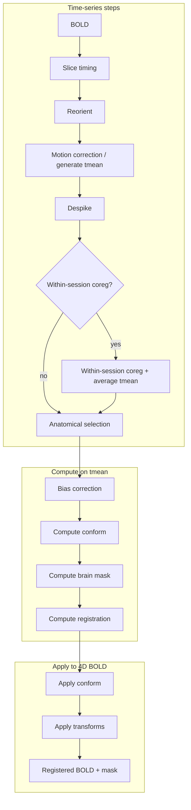

# 4. Core Components and Methods (Expanded)

This section describes each major component of banana and the methods (algorithms and tools) used within them. Section 5 (Methods/Algorithms) from the outline is incorporated here under the relevant subsections.

---

## 4.1 BIDS Discovery and Job Creation

**Purpose**: Before the Nextflow pipeline runs, a Python discovery step scans the BIDS dataset and produces structured job descriptors so that the workflow knows what to process and how (e.g. whether to run anatomical synthesis, which sessions/runs belong together).

**Behavior**:
- The discovery script uses BIDS (and NHP-BIDS) layout and metadata to find anatomical and functional files.
- For each anatomical job, it evaluates whether **synthesis** is needed (`needs_synth`) based on the number of runs/sessions and configuration. It also determines **synthesis type** (T1w vs T2w) and **synthesis level** (session vs subject).
- Output is typically one or more job JSON files (or equivalent) that Nextflow reads to build channels. Each job encodes subject, session, run(s), file paths, and flags such as `needs_synth` and `synthesis_type`.
- BIDS utilities support parsing BIDS entities, creating BIDS filenames, and resolving metadata so that discovery and downstream steps stay BIDS-compliant.

**Methods**: Discovery itself is a deterministic scan and grouping logic; no imaging algorithms. It relies on BIDS parsing and config (e.g. `anat.synthesis_level`, `anat.synthesis_type`).

---

## 4.2 Anatomical Processing

**Purpose**: Turn raw (or synthesized) anatomical T1w/T2w into bias-corrected, skull-stripped, and optionally template-registered images (and optionally segmentations/surfaces). This branch feeds T2w and functional workflows with a single reference anatomical per subject/session.

**Anatomical workflow** (from `workflows/anatomical_workflow.nf`):

```mermaid
flowchart TB
  subgraph T1w["T1w pipeline"]
    A1[Raw / synthesized T1w] --> A2[Reorient]
    A2 --> A3[Conform]
    A3 --> A4[Skull stripping & segmentation]
    A4 --> A5[Bias correction]
    A5 --> A6[Publish Phase 1]
    A6 --> A7[Registration]
    A7 --> A8{Surface recon?}
    A8 -->|yes| A9[Surface reconstruction]
    A8 -->|no| A10[End]
  end
  subgraph T2w["T2w branch"]
    B1[Synthesized / single T2w] --> B2[Reorient]
    B2 --> B3[T2w→T1w registration]
    B3 --> B4[Apply T1w conform]
    B4 --> B5[Bias correction]
    B5 --> B6[Apply T1w registration]
    B6 --> B7{T1wT2w combined?}
    B7 -->|skullstrip on| B8[T1wT2w combined]
    B7 -->|no| B9[End]
  end
```

T1w and T2w run in parallel; T2w uses T1w’s conform and registration outputs where a T1w reference exists.

### 4.2.1 Anatomical synthesis (when multiple runs/sessions)

**Method**: Implemented in `synthesis_multiple_anat.py`.  
- **Input**: A list of anatomical files (same modality: T1w or T2w) for a session or subject, depending on `synthesis_level`.  
- **Reference**: The first file in the list is used as the fixed reference.  
- **Coregistration**: Each other image is rigidly coregistered to the reference using **ANTs** (`ants_register` with rigid transform). This preserves brain geometry while aligning runs/sessions.  
- **Averaging**: All coregistered images (including the reference) are averaged in the reference space.  
- **Output**: One synthesized NIfTI file per (sub, ses) or per subject, with BIDS naming that drops `run` (and, for subject-level synthesis, `ses`).  
- **Usage**: The result is the single anatomical input to the rest of the anatomical pipeline (reorient, conform, skull stripping & segmentation, bias correction, registration). T2w and functional workflows then use this synthesized (or single-run) anatomical as their reference where configured.

Session-level synthesis combines multiple runs within one session; subject-level synthesis combines across sessions for one subject (see `docs/ANAT_SYNTHESIS_FLOW.md`).

### 4.2.2 Reorient and conform

- **Reorient**: Image is reoriented to a target orientation (e.g. RAS or template orientation) using utilities in `src/nhp_mri_prep/utils/mri.py`. This standardizes orientation before conform and registration.  
- **Conform**: Image is conformed so the brain is upright and aligned to a template (similar orientation and space). The conform step uses UNet skull stripping (nhp_skullstrip_nn) to facilitate alignment and resampling to the template.

### 4.2.3 Skull stripping and segmentation

- **Purpose**: Provide tissue/parcellation segmentation and brain mask. 
- **Segmentation**: FastSurfer-style segmentation in `src/fastsurfer_nn/`. Retrain on macaque MRI with CHARM and SARM level 2 atlas.
- **Brain mask**: Brain mask is derived from segmentation.
- **Outputs**: Segmentation volume (e.g. `desc-brain_segmentation.nii.gz` or atlas-labelled), and optionally hemisphere mask and LUT. These feed T1wT2w combined (when enabled) and surface reconstruction (§4.2.6). 

### 4.2.4 Bias field correction

- **Method**: N4-style bias field correction. The mask (§4.2.3) restricts the bias correction to the brain.  
- **Output**: Bias-corrected full-head anatomical and bias-corrected brain are saved (e.g. `desc-biascorrect_T1w.nii.gz`, `desc-biascorrect_T1w_brain.nii.gz`); the pipeline then publishes Phase 1 (e.g. `desc-preproc`) and uses the bias-corrected brain for registration.

### 4.2.5 Registration to template

- **Method**: ANTs registration in `src/nhp_mri_prep/operations/registration.py`. A multi-stage approach is used: typically **translation → rigid → affine → (optional) SyN**. Each stage has configurable gradient step, metric (e.g. mutual information, cross-correlation), shrink factors, convergence, and smoothing.  
- **Transform types**: Translation, rigid, affine, and SyN are composed; default parameters are defined in `REGISTRATION_STEP_DEFAULTS`.  
- **Output**: Template-space anatomical, forward and inverse transforms (e.g. H5 format). Downstream steps (functional registration, T2w alignment) can use these transforms to map data into template space or to the preprocessed anatomical.

### 4.2.6 Surface reconstruction

**Purpose**: Build cortical surfaces from the brain segmentation.

**Behavior**:
- **Input**: Preprocessed anatomical and segmentation (e.g. from fastsurfer_nn). Optionally uses T1wT2w combined image when configured.
- **Method**: Surface reconstruction follows a FastSurfer-like pipeline: mesh extraction, inflation, and registration to an atlas, with atlas and config under `fastsurfer_surfrecon/` (e.g. `fastsurfer_recon/atlas/`).
- **Output**: Surface meshes and derived measures; outputs are written in BIDS derivatives where applicable.
- **Resource usage**: This step is typically long-running and memory-intensive (see `docs/RESOURCE_USAGE_SUMMARY.md`); it is optional so that users can skip it when only volume-based preprocessing is needed.

---

## 4.3 Functional Processing

**Purpose**: Preprocess BOLD data (slice timing, motion, despiking, bias correction, skull stripping, registration) and produce BOLD in native or template space with associated transforms and QC.

**Location**: Nextflow modules `modules/functional.nf`; step logic in `src/nhp_mri_prep/steps/functional.py`; operations in `src/nhp_mri_prep/operations/preprocessing.py` and `registration.py`.

**Functional workflow** (from `workflows/functional_workflow.nf`):

Compute phase (F9–F12) runs on the temporal mean (or session-averaged tmean when within-session coreg is on). Apply phase (F13–F14) applies the resulting conform and registration transforms to the full 4D BOLD and to the brain mask.

**Methods**:
- **Slice timing correction**: Implemented in `preprocessing.py`; typically uses **AFNI** or **FSL** to correct for slice acquisition order.  
- **Motion correction**: Uses **AFNI** or **FSL** for volume realignment; produces motion parameters and a realigned 4D dataset.  
- **Despiking**: **AFNI**-style despiking to reduce extreme timepoints.  
- **Bias correction**: Same N4-style (or equivalent) approach as anatomical, applied on the mean functional image to derive a field that can be used for the 4D data.  
- **Skull stripping**: Same UNet framework as anatomical but with the **functional** skull-stripping model (`skullstripping_func.model`) run on the temporal mean.  
- **Registration**: ANTs used to register the mean functional to the preprocessed anatomical or to template; then `ants_apply_transforms` (or equivalent) applies the transform to the full 4D BOLD.

---

## Summary Table (Pipeline Steps and Main Tools)

| Domain        | Step                    | Main tool / method        |
|---------------|-------------------------|----------------------------|
| Anatomical    | Synthesis               | ANTs rigid + average       |
| Anatomical    | Reorient                | AFNI                       |
| Anatomical    | Conform                 | FLIRT + UNet skullstrip    |
| Anatomical    | Skull strip & segment   | FastSurfer-style (fastsurfer_nn) |
| Anatomical    | Bias correction         | N4; after skull stripping, mask-restricted |
| Anatomical    | Registration            | ANTs                       |
| Anatomical    | Surface recon           | fastsurfer_surfrecon (optional) |
| Functional    | Slice timing            | AFNI / FSL                 |
| Functional    | Reorient                | AFNI                       |
| Functional    | Motion correction       | AFNI / FSL (or generate tmean) |
| Functional    | Despiking               | AFNI                       |
| Functional    | Within-session coreg    | ANTs (optional)            |
| Functional    | Bias correction         | N4    |
| Functional    | Conform                 | FLIRT + UNet skullstrip    |
| Functional    | Skull strip (brain mask) | UNet                      |
| Functional    | Registration            | ANTs                       |
