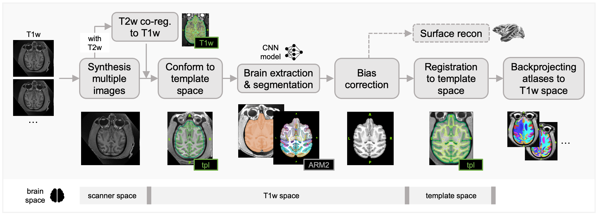
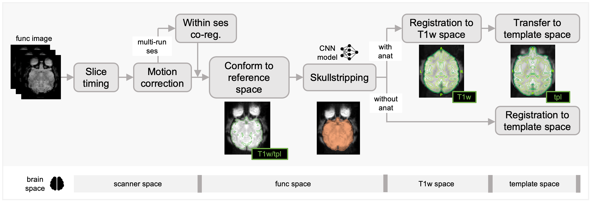

Processing details
==================

Brainana adapts its pipeline depending on what data and metadata are
available and on the configuration you provide. For example,
anatomical synthesis runs only when multiple T1w/T2w runs or sessions
are present and synthesis is enabled; slice timing correction runs
only when slice timing information is available in the BIDS metadata.

This page describes the methods used at each stage of the pipeline and
links to related anatomical and space-tracking details.

1. BIDS discovery and job creation
----------------------------------

Before the Nextflow workflow runs, a Python discovery step scans the
BIDS dataset and produces structured job descriptors.

- **Purpose:** Determine what data are available and which processing
  branches should run (e.g. whether anatomical synthesis is needed,
  whether functional runs have slice timing metadata).
- **Methods:** Deterministic layout/metadata scan using BIDS entities
  and configuration. Discovery evaluates whether anatomical synthesis
  is needed and decides synthesis type/level
  (session vs. subject) from config. There are **no imaging
  algorithms** at this stage.

2. Anatomical processing
------------------------

|

The anatomical branch turns raw (or synthesized) T1w/T2w images into
bias-corrected, skull-stripped, and template-registered images, and
optionally segmentations and cortical surfaces. These outputs provide
the anatomical reference for T2w and functional workflows.

2.1 Anatomical synthesis (multiple T1w/T2w)
~~~~~~~~~~~~~~~~~~~~~~~~~~~~~~~~~~~~~~~~~~~

When multiple T1w or T2w images exist per session or per subject,
Brainana can synthesize a single anatomical reference.

- **When:** Multiple T1w or T2w per session or subject (configurable
  synthesis level).
- **Method:** The first image (by lexicographic order) is used as the
  fixed reference. Each other image is rigidly coregistered to the
  reference using ANTs (``antsRegistration`` with a rigid transform).
  All coregistered images, including the reference, are averaged in
  the reference space.

2.2 Conform to reference
~~~~~~~~~~~~~~~~~~~~~~~

- **Purpose:** Align the brain to reference space (orientation and
  grid) so that subsequent registrations and resamplings are
  well-defined.
- **Method:**

  1. Skull-strip the input with ``nhp_skullstrip_nn`` (UNet) or use
     an existing brain mask when skull stripping is disabled.
  2. Resample the template to match the input resolution if needed.
  3. Run FSL FLIRT (rigid, 6 DOF) from the brain-extracted input to
     the template.
  4. Use AFNI ``3dresample`` to ensure template and input share a
     consistent grid.
  5. Apply the FLIRT transform back to the full-head anatomical.

2.3 Skullstripping and segmentation
~~~~~~~~~~~~~~~~~~~~~~~~~~~~~~~~~~~~

- **Purpose:** Provide brain mask and atlas/tissue segmentation for
  masking, bias correction, registration, and optional surface
  reconstruction.
- **Method:** ``fastsurfer_nn`` (FastSurfer-style CNN segmentation)
  is fine-tuned on macaque anatomical MRI with CHARM and SARM level 2
  atlases (ARM2 parcellation). The network produces an atlas-labelled
  segmentation, from which a brain mask and optional hemisphere masks
  are derived.

2.4 Bias field correction
~~~~~~~~~~~~~~~~~~~~~~~~~~~~~~~~~~~~~~

- **Purpose:** Correct intensity non-uniformity (INU) in anatomical
  images.
- **Method:** N4 bias field correction (ANTs
  ``N4BiasFieldCorrection``) is run on the anatomical image, with the
  brain mask from segmentation optionally provided to
  restrict correction to brain tissue.

2.5 Registration to template
~~~~~~~~~~~~~~~~~~~~~~~~~~~~~~~~~~~~~~~~~

- **Purpose:** Map anatomical data to a standard template space (for
  example, NMT2Sym).
- **Method:** Multi-stage ANTs registration:

  - Translation → rigid → affine → optional SyN.
  - Metrics (e.g. mutual information, cross-correlation, Mattes),
    gradient steps, shrink factors, convergence criteria, and
    smoothing schedules are configurable.
  - When GPU resources and FireANTs are available, the SyN stage can
    be run with FireANTs.

2.6 T2w to T1w coregistration
~~~~~~~~~~~~~~~~~~~~~~~~~~~~~

When T2w data are present, Brainana can coregister T2w to the
preprocessed T1w:

- **Method:** ANTs rigid registration from T2w to preprocessed T1w.

2.7 Surface reconstruction
~~~~~~~~~~~~~~~~~~~~~~~~~~~~~~~~~~~~~

Surface reconstruction is an optional and resource-intensive step.

- **Purpose:** Build cortical surfaces and morphological measures (e.g.
  thickness, area, curvature).
- **Inputs:** Preprocessed anatomical, segmentation and brain mask. 
- **Method:** ``fastsurfer_surfrecon`` is a modified version of
  FastSurfer's ``recon_surf`` pipeline. It orchestrates FreeSurfer
  volume stages (bias correction, Talairach transform, normalization,
  WM segmentation) and surface stages (tessellation, smoothing,
  inflation, topology fixing, atlas parcellation, morphometry).
- **Requirements:** A valid FreeSurfer license is required when this
  step is enabled.

3. Functional processing
------------------------

|

The functional branch preprocesses fMRI data and produces
motion-corrected, optionally slice-time-corrected, despiked,
bias-corrected, and skullstripped fMRI in native or template space,
with associated transforms and QC outputs.

The workflow is conceptually split into:

- **Time-series steps:** Slice timing (if available) →
  motion correction and temporal mean → 
  within-session coregistration and session-averaged temporal mean.
- **Compute on temporal mean:** Bias correction → conform → brain mask
  (UNet) → registration to anatomical or template.
- **Apply to 4D:** Apply conform and registration transforms to the
  4D fMRI and brain mask.

3.1 Slice timing correction
~~~~~~~~~~~~~~~~~~~~~~~~~~~

When slice timing information is available in BIDS metadata, Brainana
applies slice timing correction.

- **Purpose:** Align voxel time series in time according to the slice
  acquisition order.
- **Method:** AFNI ``3dTshift`` is used to shift slices in time to a
  reference (typically the middle of the TR). Slice timing pattern
  (e.g. ``alt+z``, ``seq+z``) is derived from the BIDS
  ``SliceTiming`` and ``SliceEncodingDirection`` fields. If slice
  encoding is not along the z axis, data are swapped to z for
  ``3dTshift`` and swapped back afterwards.
- **Control:** This step can be disabled in configuration or skipped
  when slice timing metadata are missing.

3.2 Motion correction
~~~~~~~~~~~~~~~~~~~~~

- **Purpose:** Realign fMRI volumes to correct for subject motion.
- **Method:** FSL ``mcflirt`` performs volume realignment with 6 DOF.
  The reference volume is either a user-specified timepoint, the
  middle volume, or a temporal mean (via ``fslmaths -Tmean`` or
  ``fslroi``). Outputs include motion-corrected 4D fMRI, motion
  matrices, and motion parameters (TSV).
- **Short runs:** For very short runs (e.g. fewer than 15 volumes),
  motion correction can be skipped, and pass-through outputs
  (including a temporal mean and zero-filled motion parameters) are
  generated.

3.3 Within-session coregistration
~~~~~~~~~~~~~~~~~~~~~~~~~~~~~~~~~~~~~~~~~~~~

When multiple fMRI runs exist per session, an optional within-session
coregistration step can align runs to a common reference and produce
a session-averaged temporal mean.

- **Purpose:** Improve stability of the temporal mean used for
  bias correction, conform, and registration.
- **Method:** Rigid registration from each run's temporal mean to a
  reference run's temporal mean, using ANTs or FSL FLIRT as
  configured, followed by applying the transform to the 4D fMRI and
  mask.

3.6 Bias correction
~~~~~~~~~~~~~~~~~~~~~~~~~~~~~~~~

- **Purpose:** Improve downstream registration by correcting low frequency 
  intensity inhomogeneity in the reference temporal mean fMRI image only. 
  Bias correction is not applied to the full 4D timeseries, preserving 
  the original temporal signal for subsequent analyses.
- **Method:** N4 bias field correction (ANTs
  ``N4BiasFieldCorrection``) is applied to the temporal mean of the
  motion-corrected fMRI (and to anatomical images in the anatomical
  workflow). Before N4, intensities may be rescaled to a non-zero mean
  of 100 (configurable), and any negative voxels are clamped to zero
  with a warning (N4 uses log-domain math). Anatomical bias correction
  uses a brain mask from skull stripping so background zeros are
  excluded from the histogram; functional bias correction runs earlier
  in the pipeline (before conform/skull strip) and therefore has no
  brain mask at this step—background zeros may remain in the image.

3.7 Conform and skull stripping
~~~~~~~~~~~~~~~~~~~~~~~~~~~~~~~~~~~~~~~~~~~~

- **Conform:** The functional temporal mean is conformed to the
  chosen template using the same strategy as anatomical conform:
  ``nhp_skullstrip_nn`` on the mean, FSL FLIRT rigid registration to
  the template, resampling with AFNI ``3dresample``, and application
  of the transform (optionally composed with anatomical transforms).
- **Skull stripping:** A UNet-based functional skull-stripping model
  (``nhp_skullstrip_nn`` EPI model, derived from
  NHP-BrainExtraction/DeepBet) is run on the temporal mean to obtain
  a brain mask, which is then applied to the 4D fMRI.

3.8 Registration
~~~~~~~~~~~~~~~~~~~~~~~~~~~~~~~~~~~~~~~~~~~~~~~~~~~~~~

- **Method:** ANTs registration (rigid, affine, or SyN as configured)
  from the mean functional image to the preprocessed anatomical or
  directly to the template. Composite transforms are applied to the
  4D fMRI and brain mask with ``antsApplyTransforms`` (e.g. BSpline
  interpolation for fMRI).
- **Outputs:** Preprocessed fMRI and mask in anatomical or template
  space, plus motion and other confounds for downstream analysis.

4. Summary table
----------------

.. list-table::
   :header-rows: 1

   * - Domain
     - Step
     - Main tool / method
   * - Anatomical
     - Synthesis
     - ANTs rigid + average
   * - Anatomical
     - Reorient
     - AFNI 3dresample
   * - Anatomical
     - Conform
     - FLIRT + ``nhp_skullstrip_nn`` + 3dresample
   * - Anatomical
     - Skull strip & segment
     - ``fastsurfer_nn`` (FastSurferCNN fine-tuned)
   * - Anatomical
     - Bias correction
     - ANTs N4BiasFieldCorrection
   * - Anatomical
     - Registration
     - ANTs (optional FireANTs for SyN)
   * - Anatomical
     - Surface recon
     - ``fastsurfer_surfrecon`` + FreeSurfer
   * - Functional
     - Slice timing
     - AFNI 3dTshift
   * - Functional
     - Reorient
     - AFNI 3dresample
   * - Functional
     - Motion correction
     - FSL mcflirt
   * - Functional
     - Within-session coreg
     - ANTs or FLIRT
   * - Functional
     - Bias correction
     - ANTs N4BiasFieldCorrection
   * - Functional
     - Conform / skull strip
     - FLIRT + ``nhp_skullstrip_nn`` + 3dresample
   * - Functional
     - Registration
     - ANTs (optional FireANTs for SyN)

For outputs and directory layout, see :doc:`outputs`.

.. toctree::
   :maxdepth: 1

   anat_selection_for_func
   spaces_and_transforms

