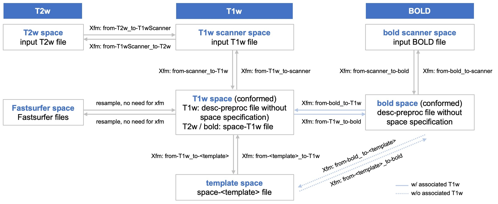

Space tracking and transforms
=============================

Brainana tracks each image through a series of coordinate spaces and
writes an explicit transform file for every space transition.  The
diagram below shows all spaces and named transforms for the T1w, T2w,
and BOLD modalities.

         for T1w, T2w, BOLD, Fastsurfer, and template spaces.
   :align: center
   :width: 100%

|

- **T1w** is conformed to the template grid (``from-scanner_to-T1w``),
  then registered to template space (``from-T1w_to-<template>``).
  ``desc-preproc_T1w.nii.gz`` carries no ``space-`` entity; template
  outputs carry ``space-<template>``.
- **T2w** is first coregistered to T1w in scanner space
  (``from-T2w_to-T1wScanner``), then brought to T1w (conformed) space
  by reusing the T1w conformation transform.  Outputs in T1w space
  carry ``space-T1w``.
- **BOLD** has its own conformation transform (``from-scanner_to-bold``).
  How BOLD reaches template space depends on whether a T1w anatomical
  is available for the session:

  - *With associated T1w* — template resampling is performed by
    composing ``from-bold_to-T1w`` with the T1w registration transform
    ``from-T1w_to-<template>``; no separate bold-to-template file is
    written.
  - *Without associated T1w* — BOLD is registered directly to the
    template, producing dedicated ``from-bold_to-<template>`` and
    ``from-<template>_to-bold`` transforms.

  ``desc-preproc_bold.nii.gz`` carries no ``space-`` entity; T1w and
  template outputs carry ``space-T1w`` and ``space-<template>``
  respectively.
- **Fastsurfer** space is reached from T1w (conformed) space by
  resampling only — no transform file is produced.

Transform file reference
------------------------

All transform filenames follow the convention
``<prefix>_from-<src>_to-<dst>_mode-image_xfm.<ext>``.
FSL ``.mat`` files are rigid conformation transforms; ANTs ``.h5``
files are composite registration transforms (affine ± SyN).

.. list-table::
   :header-rows: 1
   :widths: 15 55 30

   * - Modality
     - File (``<prefix>_…``)
     - Direction
   * - T1w
     - ``from-scanner_to-T1w_mode-image_xfm.mat``
     - T1w scanner → T1w
   * - T1w
     - ``from-T1w_to-scanner_mode-image_xfm.mat``
     - T1w → T1w scanner
   * - T1w
     - ``from-T1w_to-<template>_mode-image_xfm.h5``
     - T1w → template
   * - T1w
     - ``from-<template>_to-T1w_mode-image_xfm.h5``
     - Template → T1w
   * - T2w
     - ``from-T2w_to-T1wScanner_mode-image_xfm.h5``
     - T2w scanner → T1w scanner
   * - T2w
     - ``from-T1wScanner_to-T2w_mode-image_xfm.h5``
     - T1w scanner → T2w scanner
   * - BOLD
     - ``from-scanner_to-bold_mode-image_xfm.mat``
     - bold scanner → bold
   * - BOLD
     - ``from-bold_to-scanner_mode-image_xfm.mat``
     - bold → bold scanner
   * - BOLD
     - ``from-bold_to-T1w_mode-image_xfm.h5``
     - bold → T1w
   * - BOLD
     - ``from-T1w_to-bold_mode-image_xfm.h5``
     - T1w → bold
   * - BOLD (w/o T1w)
     - ``from-bold_to-<template>_mode-image_xfm.h5``
     - bold → template (direct, no associated T1w)
   * - BOLD (w/o T1w)
     - ``from-<template>_to-bold_mode-image_xfm.h5``
     - Template → bold (direct, no associated T1w)

Applying transforms to images
-----------------------------

Use the demo below to choose source space, target space, and data type. It
outputs the matching command.

- **Single-step paths only** — the demo lists direct transforms. If you need
  two steps, a hint below the code will suggest the intermediate space.
- **Tool** depends on the transform file:

  - ``.mat`` → ``flirt`` (FSL)
  - ``.h5`` → ``antsApplyTransforms`` (ANTs)
  - Fastsurfer ↔ T1w → ``3dresample`` (AFNI); no transform file, only a
    reference image for the target grid.
  - **No tool installed?** Mount your data and run the command inside the
    Brainana Docker image::

      docker run -it --rm \
        -v /path/to/your/data:/data \
        liuxingyu987/brainana:latest bash

      # then run your flirt / antsApplyTransforms / 3dresample command as usual

- **Interpolation** is automatic: nearest-neighbour for discrete data (labels,
  segmentations); trilinear for ``flirt`` and BSpline for
  ``antsApplyTransforms`` on intensity images.

Demo: command to apply a transform
^^^^^^^^^^^^^^^^^^^^^^^^^^^^^^^^^^

.. raw:: html

   

   

     

       

         <label for="xfm-src">From (source space)</label>
         <select id="xfm-src">
           <option value="scanner-T1w">T1w scanner space</option>
           <option value="T1w">T1w space</option>
           <option value="template">Template space</option>
           <option value="scanner-T2w">T2w scanner space</option>
           <option value="scanner-bold">bold scanner space</option>
           <option value="bold-withT1w">bold space (w/ T1w)</option>
           <option value="bold-noT1w">bold space (w/o T1w)</option>
           <option value="fastsurfer">Fastsurfer space</option>
         </select>
       

       

         <label for="xfm-dst">To (target space)</label>
         <select id="xfm-dst"></select>
       

       

         <label for="xfm-dtype">Data type</label>
         <select id="xfm-dtype">
           <option value="discrete">Discrete (label map, segmentation)</option>
           <option value="continuous">Continuous (intensity image)</option>
         </select>
       

     

     <pre id="xfm-code"></pre>
     

   

   
