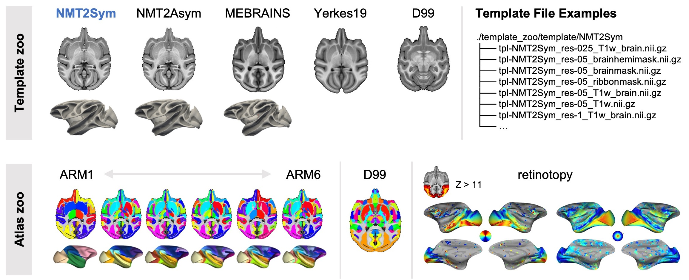

Template and atlas zoo
======================

Brainana supports multiple NHP templates and atlases for
registration and parcellation. The overview below summarizes the
template and atlas options available in the pipeline.

|

Template zoo
------------

Download: `template_zoo/template <https://github.com/xingyu-liu/brainana/tree/main/template_zoo/template>`_

The following templates can be used as ``output_space`` (e.g. in
:ref:`command-line-arguments` or in the configuration). Choose a
template and/or resolution (e.g. ``NMT2Sym:res-05``) via the
`configuration generator <_static/config_generator.html>`_ or a config YAML.

- **NMT2Sym** (`doi <https://doi.org/10.1016/j.neuroimage.2021.117997>`_) — NMT v2 symmetric template.

  * Multiple resolutions are available (e.g. res-025, res-05, res-1).
  * NMT2Sym:res-05 is the Brainana default.

- **NMT2Asym** (`doi <https://doi.org/10.1016/j.neuroimage.2021.117997>`_) — NMT v2 asymmetric (left/right preserved) template.

- **MEBRAINS** (`doi <https://doi.org/10.1162/imag_a_00077>`_)

- **Yerkes19** (`doi <https://doi.org/10.1523/JNEUROSCI.0493-16.2016>`_)

- **D99** (`doi <https://doi.org/10.1016/j.neuroimage.2008.10.058>`_) 

Atlas zoo
---------

Download: `template_zoo/atlas <https://github.com/xingyu-liu/brainana/tree/main/template_zoo/atlas>`_

- **ARM1–ARM6** (`doi <https://doi.org/10.1016/j.neuroimage.2021.117997>`_) — Combined hierarchical macaque brain atlas.

  * ARM merges `CHARM <https://afni.nimh.nih.gov/pub/dist/doc/htmldoc/nonhuman/macaque_tempatl/atlas_charm.html>`_ for cortical regions
    and `SARM <https://afni.nimh.nih.gov/pub/dist/doc/htmldoc/nonhuman/macaque_tempatl/atlas_sarm.html>`_ for subcortical regions.
  * Six levels of parcellation granularity are available (1 = coarsest, 6 = finest).
  * Brainana performs individual ARM2 parcellations for T1w data.

- **D99**

  * Saleem, K.S. & Logothetis, N.K. *A combined MRI and histology atlas of
    the rhesus monkey brain.* San Diego, CA: Academic Press, 2007.

- **Retinotopy** (`doi <https://doi.org/10.1523/JNEUROSCI.0569-17.2017>`_) — Group-average polar angle and eccentricity maps for mapping visual field representations (e.g. V1, V2, V3).

.. note::

   FreeSurfer-format surfaces and atlases for NMT2Sym, NMT2Asym, and MEBRAINS
   are available at `macaque_template_surfaces <https://github.com/xingyu-liu/macaque_template_surfaces>`_.
