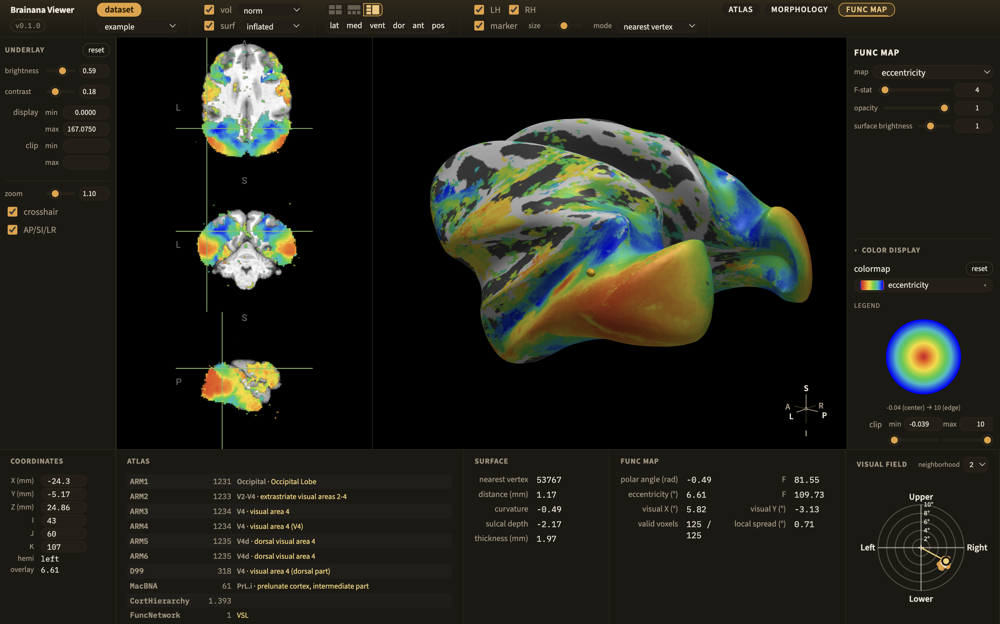

:og:description: Brainana Viewer — a free, cross-platform (macOS/Windows/Linux) NiiVue desktop viewer for exploring Brainana macaque MRI outputs: anatomical volumes, 3D cortical surfaces, atlases, and functional maps.

.. meta::
   :description: Brainana Viewer — a free, cross-platform (macOS/Windows/Linux) NiiVue desktop viewer for exploring Brainana macaque MRI outputs: anatomical volumes, 3D cortical surfaces, atlases, and functional maps.
   :keywords: Brainana Viewer, NiiVue, macaque MRI viewer, NHP neuroimaging, surface rendering, brain atlas, functional maps, retinotopy, WebGL2

Brainana Viewer
===============

**Brainana Viewer** is a free, open-source desktop application for exploring the
outputs of the Brainana pipeline. Built on `NiiVue <https://github.com/niivue/niivue>`_
and WebGL2, it runs on macOS, Windows, and Linux, and lets you inspect anatomical
volumes, 3D cortical surfaces, brain atlases, and functional maps for each processed
subject (``sub-*``) in a single integrated interface.

|

Features
--------

- **Volumes and surfaces** — volume slicing and rotatable 3D cortical surface rendering.
- **Surface morphometry** — curvature, sulcal depth, and thickness maps on the surface.
- **Atlas overlays** — automatic brain-atlas overlays with region identification.
- **Functional maps** — display functional results such as retinotopy and somatotopy.
- **Local or remote data** — open outputs on your machine or over SSH/SFTP.
- **Multi-subject comparison** — view and compare several subjects side by side.

The Viewer consumes Brainana derivatives directly — preprocessed anatomical data,
FreeSurfer-derived surfaces, atlas parcellations, and functional maps — so no manual
conversion is required.

Get the viewer
--------------

Download installers for macOS (``.dmg``), Windows (``.exe``), and Linux
(``.AppImage``/``.deb``) from the
`Brainana Viewer repository <https://github.com/arcaro-lab/brainana_tools>`_, which also
hosts the documentation and full feature list. No account is required, and demo datasets
are included for immediate exploration.
