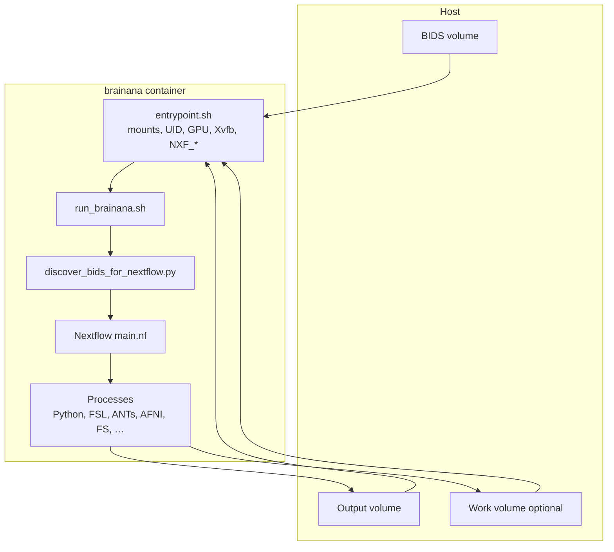

# Brainana workflow manager and Docker implementation

This note explains **two layers** in brainana: **Docker** supplies a fixed runtime (tools + Python + Nextflow binary), and **Nextflow** supplies dataset-scale orchestration (DAG, parallelism, resume, resources). It then walks through how they connect in practice and where the code lives.

---

## How Nextflow and Docker each work—and work together

### Roles in one sentence

| Layer | Responsibility |
|-------|----------------|
| **Docker** | Ship and run **one known environment**: neuroimaging CLIs, Python deps, Java/Nextflow, GPU/Xvfb bits, and host-friendly defaults (mounts, UID, work dirs). |
| **Nextflow** | Turn a BIDS study into a **DAG of processes**: discover jobs, wire channels, run tasks in parallel, cache/resume, allocate CPUs/RAM, and coordinate GPU concurrency inside the workflow logic. |

They are **not duplicates** of each other: Docker answers “*what machine are we on?*”; Nextflow answers “*what runs when, on which inputs, with what resources?*”.

### What Docker does (in brainana)

- **Build** (`Dockerfile`): multi-stage image with ANTs (prebuilt zip), FSL, AFNI, slim FreeSurfer, Python venv via `uv`, optional FireANTs CUDA build, pinned Nextflow, and `/etc/profile.d/neuroenv.sh` for consistent `PATH` / `LD_LIBRARY_PATH`.
- **Run** (`entrypoint.sh`): validate bind mounts, map **Nextflow state** (`NXF_HOME`, `NXF_WORK`, `NXF_LAUNCH_DIR`) onto a **persistent work directory** (default beside output), align **container UID** with mounted output owner via `gosu` when possible, probe FreeSurfer license if surf recon is on, start **Xvfb** for headless QC, then exec **`./run_brainana.sh run main.nf ...`**.
- **Policy:** sets **`NXF_NO_DOCKER=1`** inside the image so Nextflow does **not** spawn a *second* container per task—the brainana container **is** already the full runtime.

### What Nextflow does (in brainana)

- **`run_brainana.sh`**: CLI normalization, optional **BIDS discovery** before `main.nf`, then invokes Nextflow with project `nextflow.config`.
- **`main.nf` + `workflows/*.nf` + `modules/*.nf`**: declare processes (Python + external tools), connect outputs to downstream inputs, branch anat vs func, nested surf recon, QC, and a **shared GPU token queue** across workflows.
- **`workflows/param_resolver.groovy`**: merge **CLI → YAML → defaults**, emit **effective config** for every task.
- **`nextflow.config`**: `workDir`, retries, per-process CPU/RAM, thread env from `task.cpus`, optional **`process.container`** when *not* inside the all-in-one image (see modes below).

### How they work together (recommended path)

Typical user flow: **`docker run ... image /input /output --work-dir ...`**.

1. **Host** bind-mounts BIDS, output, and (strongly recommended) a persistent work directory.
2. **Docker** starts the container; **entrypoint** prepares identity, env, and Nextflow home on writable mounts.
3. **`run_brainana.sh`** runs **discovery** → JSON job lists for channels.
4. **Nextflow** executes the DAG; each **process** runs *inside the same container filesystem* (no nested Docker in this mode).
5. **Outputs and cache** land on host mounts, so reruns **resume** and are inspectable after the container exits.

### Two execution modes (same workflow, different outer shell)

| Mode | Who runs Docker | `NXF_NO_DOCKER` | Typical use |
|------|-----------------|-----------------|-------------|
| **A. Single-container (recommended)** | You `docker run` once; entrypoint sets `NXF_NO_DOCKER=1` | **Set** (inside container) | Production, CI, laptops: one image = full stack. |
| **B. Nextflow-spawned containers** | Nextflow executor pulls/runs `brainana:latest` per process | **Unset** on the host | Dev / clusters where each task should be its own container. |

Mode A avoids **double containerization** (container-in-container) and matches the published Docker UX: **the image is the computer**, Nextflow is the **scheduler on that computer**.

---

## Pipeline architecture (Nextflow detail)

### 1. Entry point and launcher

- **`run_brainana.sh`** wraps the Nextflow CLI: resolves `main.nf` (or another `.nf`), normalizes arguments (e.g. `--work-dir` / `--config`), sets `NXF_HOME`, log path, and **launch directory** (so `.nextflow/` metadata can live on a persistent volume—important for **resume** in Docker).
- For `run` on the main pipeline, it invokes **BIDS discovery** before starting Nextflow (see below).

### 2. Top-level Nextflow workflow

- **`main.nf`** (DSL 2) composes sub-workflows, notably:
  - **`ANAT_WF`** – anatomical path (including nested surface reconstruction where configured).
  - **`FUNC_WF`** – functional path, fed outputs from anatomical registration when not `anat_only`.
  - **QC report** generation after the main branches.
- **`workflows/param_resolver.groovy`** merges configuration with priority **CLI → user YAML → `defaults.yaml`**, and generates an **effective config** file so every process reads the same resolved settings.
- A **global GPU token queue** (`DataflowQueue` in `main.nf`) is shared across anatomical and functional workflows so concurrent GPU jobs respect `max_jobs_per_gpu` across the whole run, not per sub-workflow in isolation.

### 3. Pre-flight BIDS discovery (Python)

- **`src/nhp_mri_prep/nextflow_scripts/discover_bids_for_nextflow.py`** runs **before** Nextflow when the wrapper runs the main pipeline with `bids_dir` / `output_dir` (and related args).
- Responsibilities:
  - Optional BIDS validation (`bids-validator` when available).
  - Discover anatomical and functional **jobs** from the dataset (and optional filters: subjects, sessions, tasks, runs).
  - Print a **summary** of what will run.
  - Write **JSON** files under the output/nextflow reporting area for Nextflow to read and turn into **channels**.

This separates **validation and planning** from execution so failures are obvious early and progress reporting can reflect the full job set.

### 4. Sub-workflows and modules

- **`workflows/anatomical_workflow.nf`**, **`workflows/functional_workflow.nf`**, **`workflows/surfrecon_workflow.nf`**, etc., chain **processes** defined in **`modules/*.nf`**.
- Each process typically invokes **`${PYTHON}`** or external tools with paths into `src/` (via `PYTHONPATH` in `nextflow.config`).
- **Groovy helpers** (`channel_helpers.groovy`, `config_helpers.groovy`, etc.) keep channel construction and config paths consistent.

### 5. `nextflow.config` (global execution policy)

- **`workDir`** – centralized intermediate files (CLI `--work_dir`, `NXF_WORK`, or default under home).
- **Docker toggle** – `nextflow.config` treats **`NXF_NO_DOCKER`** as “disable Nextflow’s Docker integration”; when Docker is enabled, `process.container` can point at `brainana:latest` and add `--gpus all` when GPUs exist (host-side Nextflow-container mode).
- **GPU hints** – `nvidia-smi` at config parse time for GPU count and a heuristic for concurrent jobs per GPU from free VRAM.
- **`stageInMode = 'copy'`** – avoids symlink issues on some bind mounts / filesystems.
- **`beforeScript`** – sets `OMP_NUM_THREADS`, `MKL_NUM_THREADS`, `ITK_GLOBAL_DEFAULT_NUMBER_OF_THREADS`, etc., from **`task.cpus`**.
- **Retries** – default `errorStrategy = 'retry'` with overrides per process where needed.
- **Per-process labels** – CPU and memory tuned from calibration (see comments referencing `docs/` resource docs).

### 6. Python “workflows” inside packages

Some subpackages (e.g. **fastsurfer_surfrecon**) expose a **Python class pipeline** for their own multi-step logic. That is **in-process** orchestration for that component. It complements—but does not replace—the **Nextflow** layer that scales across a full BIDS dataset.

---

## Docker container implementation (`Dockerfile` + `entrypoint.sh`)

Brainana ships a **single runtime image** (Debian Bookworm–based) built by a **multi-stage** `Dockerfile` so heavy compile steps and large downloads stay out of the final layer where possible.

### Image build (`Dockerfile`)

| Stage / concern | What it does |
|-----------------|----------------|
| **`ants-builder`** | Downloads a **pre-built ANTs** release zip (generic x86-64) into `/opt/ants` instead of compiling on the build host—avoids CPU-feature binaries that break under QEMU/Rosetta on Apple Silicon. |
| **`python-builder`** | Installs **`uv`**, copies `pyproject.toml` / `uv.lock` / project tree, creates **`/opt/venv`**, and runs **`uv sync`** (or editable pip fallback). Strips caches/tests from the venv to shrink the image. |
| **`fireants-fused-ops-builder`** | Adds **CUDA toolkit** and builds **FireANTs `fused_ops`** into the same venv with a fixed **`TORCH_CUDA_ARCH_LIST`** so PyTorch extensions compile without a GPU at build time; fused ops load with `--gpus all` at runtime. |
| **`freesurfer-download`** | Fetches FreeSurfer tarball and extracts with an **exclude list** (`docker/files/freesurfer7.4.1-exclude.txt`) for a slimmer install (e.g. no bundled subject data for NHP-focused use). |
| **Final runtime image** | Installs OS packages (OpenGL/X11 stack for AFNI/FSL/FS, **Connectome Workbench**, **Xvfb**, **Java 17**, **graphviz** for Nextflow DAG SVG, **procps** for metrics, **gosu**, locales, etc.). Copies **ANTs**, **FSL** (with pruning of unused dirs), **AFNI** tarball, **FreeSurfer** from prior stages, and the **Python venv** from builders. |

**Runtime layout and environment**

- **Project root:** `/opt/brainana` (repo copy from builder); **`PYTHONPATH=/opt/brainana/src`** so `nhp_mri_prep` and other packages import without extra installs.
- **Python:** `PATH` prefers **`/opt/venv/bin`**; caches like **`MPLCONFIGDIR`** / **`PYTHONPYCACHEPREFIX`** point under **`/tmp`** so arbitrary UIDs (after `gosu`) can write.
- **Tool paths:** `/etc/profile.d/neuroenv.sh` exports **`FSLDIR`**, **`AFNI_HOME`**, **`ANTSPATH`**, **`FREESURFER_HOME`**, **`FS_LICENSE`**, **`PATH`**, **`LD_LIBRARY_PATH`** (ANTS + FSL libs), and optional **venv CUDA/torch** paths for FireANTs fused ops.
- **Nextflow:** Pinned **`NXF_VER`**, **`NXF_HOME=/opt/nextflow`** with framework pre-downloaded at build time so cold starts avoid network fetches.
- **Process identity:** Image does **not** `USER neuro` by default; the **entrypoint** runs as root first, then drops privileges (see below).
- **Container interface:** **`ENTRYPOINT`** → `/opt/brainana/entrypoint.sh`; **`CMD`** → `/input` `/output` as positional BIDS/output mounts.

### Runtime entrypoint (`entrypoint.sh`)

The entrypoint is the **Docker-specific policy layer** between bind mounts and Nextflow:

1. **Sources `neuroenv.sh`** so non-interactive Nextflow subprocesses inherit the same tool and library paths as an interactive shell.
2. **Parses arguments:** input dir, output dir, `--config` / `--work-dir`, `--freesurfer-license`, **`--no-resume`**, and passes the rest through. Default config is **`/opt/brainana/src/nhp_mri_prep/config/defaults.yaml`**.
3. **Validates mounts:** requires a readable **`INPUT_DIR`**; ensures **`OUTPUT_DIR`** exists and is writable (matches README expectations for pre-created or host-owned dirs).
4. **Work / Nextflow state:** default work root **`${OUTPUT_DIR}_wd`** if `--work-dir` omitted; sets **`NXF_HOME`**, **`NXF_WORK`**, **`NXF_LAUNCH_DIR`** under that tree and may symlink the pre-cached Nextflow framework from `/opt/nextflow`—so **resume metadata lives on the mounted work volume**, not only inside ephemeral container layers.
5. **User mapping (root → host UID):** if running as root, **`stat`** the mounted output owner, **`chown`** the work dir to that UID/GID when possible, uses **`useradd`** / **`groupadd`** to create matching passwd/group entries when the container lacks that UID, adds the pipeline user to **GPU device GID** and **`render`** for `/dev/nvidia*` / DRM access, then **`exec gosu <username> ./run_brainana.sh run main.nf ...`** so files on the host are not root-owned. Falls back to root with warnings if user creation fails (e.g. restrictive environments).
6. **FreeSurfer:** if surface reconstruction is enabled in merged config logic, requires **`--freesurfer-license`**, checks the file exists, and runs a lightweight **`mri_convert`** license probe before starting the pipeline.
7. **Headless display:** starts **Xvfb** on a default **`DISPLAY`** for QC / OpenGL paths that expect an X server.
8. **Launches the same path as bare metal:** **`./run_brainana.sh run main.nf`** with BIDS/output/config; appends **`-resume`** by default unless **`--no-resume`**.
9. **Sets `NXF_NO_DOCKER=1`** here so Nextflow does not try to spawn nested task containers—already inside the brainana image.

Together, **`Dockerfile`** answers “what software is in the box,” and **`entrypoint.sh`** answers “how that box behaves on real clusters and laptops” (mounts, users, GPUs, resume, licenses, Nextflow home).

---

## Benefits

| Area | Benefit |
|------|--------|
| **Parallelism** | Many independent jobs (subjects, sessions, runs) run concurrently subject to executor and resource limits. |
| **Caching and resume** | Nextflow skips completed tasks when inputs and parameters are unchanged; persistent `work_dir` and metadata enable long runs to recover after interruption. |
| **Resource control** | Declared CPU/RAM per process type; shared **GPU token pool** caps GPU concurrency across anatomical and functional GPU steps. |
| **Reproducibility** | Pinned image + merged **effective config** + versioned scripts reduce environment drift versus ad hoc shell loops. |
| **Fail-fast planning** | BIDS discovery and optional validation run before the expensive DAG, surfacing bad layouts or filters early. |
| **Cross-tool consistency** | Single parameter resolution path and process `env` (threads, `PYTHONPATH`, Python executable) align behavior across heterogeneous tools. |
| **Operations** | Nextflow’s DAG, logs, and reports suit monitoring and debugging better than unstructured bash-only pipelines. |

### Docker-specific benefits

| Area | Benefit |
|------|--------|
| **Dependency stability** | One image bundles FSL, ANTs, AFNI, FreeSurfer, Nextflow, Python env, and supporting runtime libs. |
| **User/permissions behavior** | `entrypoint.sh` starts as root, then drops to output-owner UID/GID with `gosu` when possible so host-mounted outputs are not root-owned. |
| **GPU compatibility** | Container runtime supports `--gpus all`; entrypoint handles GPU device-group access for the runtime user and starts Xvfb for headless QC rendering. |
| **Resume robustness** | Entrypoint maps Nextflow state (`NXF_HOME`, `NXF_WORK`, `NXF_LAUNCH_DIR`) into persistent work dirs under output/work mounts to keep resume metadata. |
| **Reproducible runtime behavior** | Nextflow version is pinned (`NXF_VER`), framework is pre-cached, and shell env scripts standardize PATH/LD_LIBRARY_PATH/tool vars. |

---

## Key file map

| Path | Role |
|------|------|
| `run_brainana.sh` | Launcher, discovery hook, arg normalization |
| `main.nf` | Top-level Nextflow workflow, GPU queue, QC wiring |
| `nextflow.config` | Executor defaults, optional per-task Docker, resources, threading |
| `Dockerfile` | Multi-stage build of the brainana runtime image (neuroimaging stack + Python env + Nextflow) |
| `entrypoint.sh` | Container runtime policy (UID/GID mapping, resume dirs, license checks, Xvfb, handoff to `run_brainana.sh`) |
| `workflows/*.nf` | Sub-workflows (anat, func, surf recon, …) |
| `modules/*.nf` | Process definitions calling Python/CLI |
| `workflows/param_resolver.groovy` | CLI + YAML merge, effective config |
| `src/nhp_mri_prep/nextflow_scripts/discover_bids_for_nextflow.py` | Pre-Nextflow BIDS job discovery and JSON for channels |
| `src/nhp_mri_prep/...` | Step implementations used by modules |

---

## Bottom line

- **Docker** implements the **reproducible runtime**: what is installed, how the process user matches mounted data, where Nextflow keeps its metadata on disk, and how GPUs and headless graphics behave in a container.
- **Nextflow** implements the **reproducible workflow**: job graph, parallelism, caching/resume, resource labels, and configuration merging across the full BIDS study.
- **Together (recommended):** you run **one** brainana container; **entrypoint** prepares the host-facing details; **Nextflow** runs **inside** that container with **`NXF_NO_DOCKER=1`**, so orchestration is layered cleanly without nesting containers per task.
