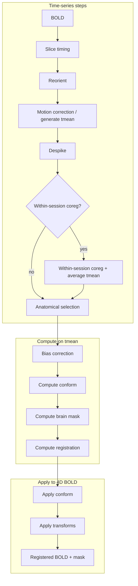

# 4. Core Components and Methods (Expanded)

This section describes each major component of brainana and the methods (algorithms and tools) used within them. Section 5 (Methods/Algorithms) from the outline is incorporated here under the relevant subsections.

brainana is a BIDS-based, Nextflow-orchestrated pipeline for macaque (and more general NHP) anatomical and functional MRI. The pipeline adapts to available data and configuration (e.g. anatomical synthesis only when multiple T1w/T2w runs or sessions are present; slice timing correction only when slice timing metadata is available; surface reconstruction optional).

**Main software stack (summary)**:

- Python 3.11+, Nextflow; AFNI, ANTs, FSL, FreeSurfer (for optional surface reconstruction); PyTorch (for UNet skull stripping and FastSurfer-style segmentation); nibabel, pybids.  
- Internal operations: **nibabel** for NIfTI I/O; **ANTs** for registration and N4 bias correction; **AFNI** for reorientation, slice timing, and despiking; **FSL** for motion correction, FLIRT-based conform, and mask application (`fslmaths`).  
- Initial skull stripping (conform and functional mask): **nhp_skullstrip_nn**, fine-tuned from DeepBet/NHP-BrainExtraction.  
- Anatomical segmentation: **fastsurfer_nn**, fine-tuned from FastSurferCNN.  
- Optional surface reconstruction: **fastsurfer_surfrecon** (modified from FastSurfer `recon_surf`) plus FreeSurfer (`mri_*`, `mris_*` tools).

---

## 4.1 BIDS Discovery and Job Creation

**Purpose**: Before the Nextflow pipeline runs, a Python discovery step scans the BIDS dataset and produces structured job descriptors so that the workflow knows what to process and how (e.g. whether to run anatomical synthesis, which sessions/runs belong together).

**Behavior**:
- The discovery script uses BIDS (and NHP-BIDS) layout and metadata (via `pybids` or equivalent utilities) to find anatomical and functional files.
- For each anatomical job, it evaluates whether **synthesis** is needed (`needs_synth`) based on the number of runs/sessions and configuration. It also determines **synthesis type** (T1w vs T2w) and **synthesis level** (session vs subject).
- Output is typically one or more job JSON files (or equivalent) that Nextflow reads to build channels. Each job encodes subject, session, run(s), file paths, and flags such as `needs_synth` and `synthesis_type`.
- BIDS utilities support parsing BIDS entities, creating BIDS filenames, and resolving metadata so that discovery and downstream steps stay BIDS-compliant.

**Methods**: Discovery itself is a deterministic scan and grouping logic; no imaging algorithms. It relies on BIDS parsing and config (e.g. `anat.synthesis_level`, `anat.synthesis_type`) to decide whether anatomical synthesis is needed and at what level.

---

## 4.2 Anatomical Processing

**Purpose**: Turn raw (or synthesized) anatomical T1w/T2w into bias-corrected, skull-stripped, and optionally template-registered images (and optionally segmentations/surfaces). This branch feeds T2w and functional workflows with a single reference anatomical per subject/session.

**Anatomical workflow** (from `workflows/anatomical_workflow.nf`):

```mermaid
flowchart TB
  subgraph T1w["T1w pipeline"]
    A1[Raw / synthesized T1w] --> A2[Reorient]
    A2 --> A3[Conform]
    A3 --> A4[Skull stripping & segmentation]
    A4 --> A5[Bias correction]
    A5 --> A6[Publish Phase 1]
    A6 --> A7[Registration]
    A7 --> A8{Surface recon?}
    A8 -->|yes| A9[Surface reconstruction]
    A8 -->|no| A10[End]
  end
  subgraph T2w["T2w branch"]
    B1[Synthesized / single T2w] --> B2[Reorient]
    B2 --> B3[T2w→T1w registration]
    B3 --> B4[Apply T1w conform]
    B4 --> B5[Bias correction]
    B5 --> B6[Apply T1w registration]
    B6 --> B7{T1wT2w combined?}
    B7 -->|skullstrip on| B8[T1wT2w combined]
    B7 -->|no| B9[End]
  end
```

T1w and T2w run in parallel; T2w uses T1w’s conform and registration outputs where a T1w reference exists.

### 4.2.1 Anatomical synthesis (when multiple runs/sessions)

**Method**: Implemented in `synthesis_multiple_anat.py`.  
- **Input**: A list of anatomical files (same modality: T1w or T2w) for a session or subject, depending on `synthesis_level`.  
- **Reference**: The first file in the list is used as the fixed reference.  
- **Coregistration**: Each other image is rigidly coregistered to the reference using **ANTs** (`ants_register` with rigid transform). This preserves brain geometry while aligning runs/sessions.  
- **Averaging**: All coregistered images (including the reference) are averaged in the reference space.  
- **Output**: One synthesized NIfTI file per (sub, ses) or per subject, with BIDS naming that drops `run` (and, for subject-level synthesis, `ses`).  
- **Usage**: The result is the single anatomical input to the rest of the anatomical pipeline (reorient, conform, skull stripping & segmentation, bias correction, registration). T2w and functional workflows then use this synthesized (or single-run) anatomical as their reference where configured.

Session-level synthesis combines multiple runs within one session; subject-level synthesis combines across sessions for one subject (see `docs/ANAT_SYNTHESIS_FLOW.md`).

### 4.2.2 Reorient and conform
- **Reorient**: Image is reoriented to a target orientation (e.g. RAS or template orientation) using **AFNI** `3dresample -orient` (or equivalent utilities in `src/nhp_mri_prep/utils/mri.py`). When a target file is provided, its orientation is read and the same resample step is applied so that subsequent steps see a consistent orientation.  
- **Conform**: Image is conformed so the brain is upright and aligned to a template (same orientation and grid). The conform step uses **nhp_skullstrip_nn** (a UNet skull-stripping model fine-tuned from DeepBet/NHP-BrainExtraction) to obtain a brain-extracted image, then performs rigid registration with **FSL FLIRT** (6 DOF) to the template, resamples the template to input resolution with **AFNI** `3dresample`, and applies the FLIRT transform back to the full-head anatomical with `flirt -applyxfm`.

### 4.2.3 Skull stripping and segmentation
- **Purpose**: Provide brain mask and tissue/atlas segmentation for bias correction, registration, and optional surface reconstruction.  
- **Segmentation**: **fastsurfer_nn**, a FastSurfer-style CNN segmentation model in `src/fastsurfer_nn/`, fine-tuned on macaque MRI with CHARM and SARM level 2 atlases (ARM2 parcellation).  
- **Brain mask**: A brain mask is derived from the segmentation; the mask is then applied to the anatomical with **FSL** `fslmaths -mul` to produce a skull-stripped image.  
- **Outputs**: Segmentation volume (e.g. ARM2-labelled), brain mask, and optionally hemisphere mask and LUT. These feed T1wT2w combined (when enabled) and surface reconstruction (§4.2.6).

### 4.2.4 Bias field correction
- **Method**: **N4 bias field correction** (Tustison et al. 2010), implemented via **ANTs** `N4BiasFieldCorrection`. A brain mask from §4.2.3 can be passed (`-x`) to restrict the correction to brain tissue.  
- **Output**: Bias-corrected full-head anatomical and bias-corrected brain images (e.g. `desc-biascorrect_T1w.nii.gz`, `desc-biascorrect_T1w_brain.nii.gz`). The pipeline then publishes Phase 1 outputs (e.g. `desc-preproc`) and uses the bias-corrected brain for registration.

### 4.2.5 Registration to template
- **Method**: **ANTs** registration in `src/nhp_mri_prep/operations/registration.py`. A multi-stage approach is used: typically **translation → rigid → affine → (optional) SyN**, with configurable metrics (e.g. mutual information, cross-correlation, Mattes), gradient steps, shrink factors, convergence criteria, and smoothing schedules. When GPU resources and FireANTs are available, the SyN stage can be run with **FireANTs**; otherwise CPU `antsRegistration` is used.  
- **Transform types**: Translation, rigid, affine, and SyN transforms are composed; defaults are defined in `REGISTRATION_STEP_DEFAULTS`.  
- **Output**: Template-space anatomical plus forward and inverse composite transforms (e.g. H5). Downstream steps (functional registration, T2w alignment) reuse these transforms to move data between native anatomical and template spaces.

### 4.2.6 Surface reconstruction

**Purpose**: Build cortical surfaces from the brain segmentation.

**Behavior**:
- **Input**: Preprocessed anatomical and segmentation (e.g. from `fastsurfer_nn`); optionally a T1wT2w combined image when configured.  
- **Method**: Surface reconstruction follows a FastSurfer-like pipeline implemented in **fastsurfer_surfrecon**, a modified version of FastSurfer’s `recon_surf`. Volume stages (bias correction, Talairach, normalization, WM segmentation) and surface stages (tessellation, smoothing, inflation, topology fixing, atlas-based parcellation, morphometry) are orchestrated via Python wrappers that call **FreeSurfer** tools (e.g. `mri_convert`, `mri_mask`, `mri_pretess`, `mri_fill`, `mris_smooth`, `mris_inflate`, `mris_fix_topology`, `mris_place_surface`, `mris_register`, `mris_ca_label`, `mris_anatomical_stats`). A valid FreeSurfer license is required when surface reconstruction is enabled.  
- **Output**: Cortical surface meshes and derived measures/statistics; outputs are written in BIDS derivatives where applicable.  
- **Resource usage**: This step is typically long-running and memory- and CPU-intensive (see `docs/RESOURCE_USAGE_SUMMARY.md`); it is optional so that users can skip it when only volume-based preprocessing is needed.

---

## 4.3 Functional Processing

**Purpose**: Preprocess BOLD data (slice timing, motion, despiking, bias correction, skull stripping, registration) and produce BOLD in native or template space with associated transforms and QC.

**Location**: Nextflow modules `modules/functional.nf`; step logic in `src/nhp_mri_prep/steps/functional.py`; operations in `src/nhp_mri_prep/operations/preprocessing.py` and `registration.py`.

**Functional workflow** (from `workflows/functional_workflow.nf`):

Compute phase (F9–F12) runs on the temporal mean (or session-averaged tmean when within-session coreg is on). Apply phase (F13–F14) applies the resulting conform and registration transforms to the full 4D BOLD and to the brain mask.

**Methods**:
- **Slice timing correction**: Implemented in `preprocessing.py` using **AFNI** `3dTshift`. Slice acquisition pattern (e.g. `alt+z`, `seq+z`) is derived from BIDS `SliceTiming` and `SliceEncodingDirection`; `-tpattern` and `-tzero` are set accordingly. If slice encoding is not along \(z\), data are swapped to \(z\) for `3dTshift` and then swapped back.  
- **Motion correction**: Uses **FSL** **mcflirt** for volume realignment; the reference volume is either a specified timepoint, the middle volume, or a temporal mean (`fslmaths -Tmean` or `fslroi`). Outputs include realigned 4D BOLD, motion matrices, and TSV motion parameters. Very short runs (e.g. \< 15 volumes) can skip motion correction and use pass-through outputs.  
- **Despiking**: **AFNI** `3dDespike` with configurable `-cut` and optional `-localedit` to reduce extreme timepoints in the BOLD signal; skipped for very short runs.  
- **Bias correction**: Same **N4BiasFieldCorrection** approach as anatomical, applied to the temporal mean of the motion-corrected/despiked BOLD (mask optional). The resulting field can be applied to the full 4D dataset.  
- **Skull stripping**: Same UNet framework as anatomical but with the **functional** skull-stripping model (`nhp_skullstrip_nn` EPI model). The model runs on the temporal mean to obtain a brain mask, which is then applied to the 4D BOLD with `fslmaths -mas`.  
- **Registration**: **ANTs** registration (rigid, affine, or SyN, as configured) from the mean functional image to the preprocessed anatomical or directly to template (optionally at functional resolution). Composite transforms are applied to the full 4D BOLD and brain mask with `antsApplyTransforms` (e.g. BSpline interpolation for BOLD). Optional GPU-accelerated SyN is available via **FireANTs** when installed.

---

## Summary Table (Pipeline Steps and Main Tools)

| Domain     | Step                    | Main tool / method                          |
|-----------|--------------------------|---------------------------------------------|
| Anatomical| Synthesis                | ANTs rigid + average                        |
| Anatomical| Reorient                 | AFNI 3dresample                             |
| Anatomical| Conform                  | FLIRT + nhp_skullstrip_nn + 3dresample      |
| Anatomical| Skull strip & segment    | fastsurfer_nn (FastSurferCNN fine-tuned)    |
| Anatomical| Bias correction          | ANTs N4BiasFieldCorrection                  |
| Anatomical| Registration             | ANTs (optional FireANTs for SyN)            |
| Anatomical| Surface recon (optional) | fastsurfer_surfrecon + FreeSurfer           |
| Functional| Slice timing             | AFNI 3dTshift                               |
| Functional| Reorient                 | AFNI 3dresample                             |
| Functional| Motion correction        | FSL mcflirt                                 |
| Functional| Despiking                | AFNI 3dDespike                              |
| Functional| Within-session coreg    | ANTs or FLIRT (optional)                    |
| Functional| Bias correction          | ANTs N4BiasFieldCorrection                  |
| Functional| Conform / skull strip    | FLIRT + nhp_skullstrip_nn, 3dresample      |
| Functional| Registration             | ANTs (optional FireANTs for SyN)            |
