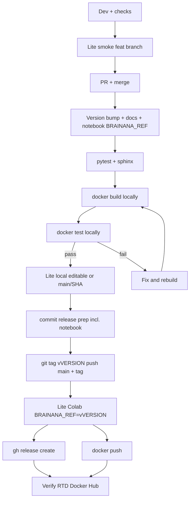

# Brainana Next Steps Tutorial: Code Changes, Docs, GitHub, and Docker Publish

This guide is a practical end-to-end workflow you can follow after making changes in `brainana`.

## 0) One-time setup (local machine)

Make sure these are installed and authenticated:

- `git`
- `python` (3.11+)
- `uv`
- `docker`
- GitHub CLI (`gh`) logged in (`gh auth login`)

For Docker Hub publish, you also need a Docker Hub account and `docker login` before `docker push`.

## Workflow overview

### Feature / PR path

1. Dev on a feature branch: checks, optional **Brainana Lite** with `BRAINANA_REF = feat/<topic>`.
2. Open PR; merge to `main` when CI is green.
3. During feature PRs: only `CHANGELOG.md` → `[Unreleased]` (do not bump `pyproject.toml` version unless you are doing the release).

### Release path (after PR merge)

Release work happens in **four phases**. **Tag** only after pre-tag gates pass on the release commit; **Colab/cloud Lite** with `v${VERSION}` only **after** the tag is pushed to GitHub.

| Phase | What you prove | When |
| ----- | -------------- | ---- |
| **A. Release prep** | Version + docs + notebook ref aligned | Uncommitted on `main` until gates pass |
| **B. Pre-tag gates** | Local code, Docker image, Lite (local) | Before `git commit` / tag |
| **C. Tag + push** | Immutable `v${VERSION}` on GitHub | After B passes |
| **D. Post-tag + publish** | Colab/users, GitHub Release, Docker Hub, RTD | After C |



**Rules:**

- Run **Brainana Lite** when you touch the notebook, `brainana[lite]` install path, or lite preprocessing/QC code (see [Brainana Lite testing](#brainana-lite-testing)).
- **On release:** bump version and sync README + RTD docs in the same uncommitted pass as `pyproject.toml` / `CHANGELOG.md`, and set `BRAINANA_REF = "v${VERSION}"` in the notebook (for the shipped default).
- Do not **commit**, **tag**, **push**, or **docker push** until pre-tag gates pass (pytest, sphinx, Docker smoke, Lite local).
- **Post-tag Colab smoke** is required for releases that ship Brainana Lite (`BRAINANA_REF=v${VERSION}` needs the tag on GitHub).
- **Git tag vs GitHub Release:** push tag `v${VERSION}` first, then `gh release create`. **Docker push** can use an image built in pre-tag phase (`BRAINANA_VERSION` build-arg, not the git tag).

**When to tag:** After you trust the release commit (pre-tag gates). Before Colab clone at `v${VERSION}`, RTD **stable**, and `gh release create`. You cannot test Colab with `BRAINANA_REF=v${VERSION}` until that tag exists on GitHub — use local editable install or `main`/commit SHA pre-tag instead.

**Tag already pushed with wrong notebook ref:** fix on `main`; if the tag is public and consumed, prefer a patch release (`v1.1.1`) rather than moving the tag. If the tag is local-only, fix the commit and re-tag before first push.

---

## Version & docs sync (release prep)

Use one `VERSION` (e.g. `1.1.0`) and update these **together on `main` before pre-tag gates** (leave changes uncommitted until tests pass).

| File / area | What to update | Notes |
| ----------- | -------------- | ----- |
| **pyproject.toml** | `version = "${VERSION}"` | Single source of truth; Docker `BRAINANA_VERSION`, Python `get_version()`, and RTD `release` in `docs/conf.py` all follow this. |
| **CHANGELOG.md** | Rename `[Unreleased]` → `[${VERSION}] - YYYY-MM-DD`; add empty `[Unreleased]` | Copy the new section into `gh release create --notes-file`. |
| **README.md** | New features, links, status, Brainana Lite, install pointers | No pinned version required (uses RTD `stable` / `latest`), but README should describe what ships in this release. |
| **docs/** (RTD) | Pages with old example versions (e.g. `1.0.0`) | `rg -n "${VERSION}\|1\\.0\\.0\|<version>" docs/` |
| **docs/** (RTD) | New/changed behavior | Add or edit RST pages so **stable** matches the release. |
| **examples/BrainanaLite.ipynb** | `BRAINANA_REF = "v${VERSION}"` | Git tag uses `v` prefix (e.g. `v1.1.0`). Docker image tag is `${VERSION}` without `v`. Colab tests this ref **after** tag push. |
| **RTD build (local)** | `sphinx-build` or `bash docs/build_rtd_local.sh` | Run **after** `pyproject.toml` bump so built HTML shows the new `release` version. |
| **RTD (hosted)** | No manual upload | After you push tag `v${VERSION}`, RTD builds **stable** from that tag; confirm green on [RTD builds](https://readthedocs.org/projects/brainana/builds/). |

**Docs / RTD gotchas:**

- **Sphinx extensions are pinned in FOUR places.** When you add or bump one, update all of them or CI/RTD fail with `No module named ...`: `.readthedocs.yaml`, `.github/workflows/docs.yml` (the PR check), `docs/build_rtd_local.sh`, and the `[docs]` extra in `pyproject.toml`.
- **Docs only reach `stable` via a release tag.** RTD `stable` = highest semver tag; edits merged to `main` appear on `latest`/`dev` immediately but **not** on `stable` until you cut a new `v${VERSION}` tag. (This is why a docs-only change may still warrant a patch/minor release.)
- **Google Search Console** ownership is verified by the static file `docs/google49dbcea2a2cad90f.html`, copied to each version's site root via `html_extra_path` in `docs/conf.py`. It is reachable at `/en/<version>/google…html` and only appears under `/en/stable/` after a release tag — do **not** delete or rename it. SEO metadata (canonical, Open Graph, JSON-LD) lives in `docs/conf.py` + `docs/_templates/layout.html`; preserve them when editing docs config.

**Dev PRs (before release):** only edit `CHANGELOG.md` under `[Unreleased]` for anything users should see in the next release. Do not change `pyproject.toml` version until release day on `main`.

**Quick grep before build:**

```bash
export VERSION=1.2.0
grep '^version' pyproject.toml
rg -n "${VERSION}|1\\.0\\.0|<version>" pyproject.toml CHANGELOG.md README.md docs/
```

---

## Pre-tag test gates

All must pass **before** `git commit` and **before** `git tag`:

1. `black --check . && ruff check . && pytest`
   - **`ruff check .` passes** — dev/scratch helpers are excluded via `[tool.ruff] extend-exclude` + per-file `E402/F401/F541` ignores in `pyproject.toml`; keep new throwaway scripts under `scripts/scratch/`.
   - **`black --check .` has ~22 files of pre-existing formatting drift** in real source (whitespace only, no logic). Green it with a **dedicated** `chore: black format` commit (`black .`), kept **out of** the release commit — never fold a repo-wide reformat into a release. No CI enforces black/ruff (only the Sphinx PR check exists), so this gate is self-discipline.
2. `sphinx-build -b html -W --keep-going -c docs docs docs/_build` (or `bash docs/build_rtd_local.sh`)
3. `docker build --build-arg BRAINANA_VERSION=${VERSION} ...` + pipeline smoke (`scripts/scratch/test_brainana_docker.sh` or `_cpu.sh`)
4. **Lite local** — `examples/test_BrainanaLite_local_instruction.sh`:
   - Prefer `uv pip install -e ".[lite]"` from the repo on `main` (`BRAINANA_REF` is ignored when importable).
   - To test the fresh-clone path pre-tag, temporarily use `BRAINANA_REF = "main"` or a **commit SHA** — not `v${VERSION}` until the tag is on GitHub.

---

## Post-tag validation and publish

After `git push origin v${VERSION}`:

1. **Lite Colab/cloud** — open notebook from GitHub; confirm `BRAINANA_REF=v${VERSION}`; **Run All** (two-pass rule).
2. Optional: `docker pull ${IMAGE}:${VERSION}` and re-run pipeline smoke on the pulled image.
3. `gh release create v${VERSION} ...`
4. `docker push ${IMAGE}:${VERSION}` (and optionally `:latest`).
5. [Verify release artifacts](#verify-release-artifacts) (RTD stable, Docker Hub, etc.).

**Cloud before tag (optional):** push release commit to `main` only, smoke Colab with `BRAINANA_REF="main"`, then set notebook to `v${VERSION}`, tag, and re-run Colab once.

---

## Brainana Lite testing

Lightweight volumetric T1w workflow in [`examples/BrainanaLite.ipynb`](../examples/BrainanaLite.ipynb). Use it to validate `brainana[lite]` outside Docker (Colab or local Jupyter).

**Colab:** upload or open from GitHub, set `WORKING_DIR` (e.g. Drive path), enable GPU runtime, then **Run All** (same two-pass rule as local).

### When to run

| Stage | Run Lite? | `BRAINANA_REF` |
| ----- | --------- | -------------- |
| Feature dev touching lite path | Yes — before PR | `feat/<topic>` |
| Release pre-tag on `main` | Yes — with Docker smoke | `main` / commit SHA / local editable (not `v${VERSION}` until tag pushed) |
| Release post-tag | Yes — Colab required | `v${VERSION}` |
| Docs-only change | Skip unless notebook/docs for Lite changed | — |

If a previous run left `WORKING_DIR/brainana_lite_env/` at an old ref, set `FORCE_REINSTALL=True` in the notebook.

---

## Minimal command cheat sheet

### Dev workflow

```bash
cd ~/github/brainana
export VERSION=1.2.0
export IMAGE=liuxingyu987/brainana

# branch
git checkout main && git pull origin main

# create a new branch, e.g.
git checkout -b feat/<topic>

# setup
uv pip install -e ".[dev,docs]"

# checks (black = format; ruff = lint)
black --check . && ruff check . && pytest

# user-facing notes for the *next* release (do not bump pyproject version here)
# edit CHANGELOG.md → [Unreleased]

sphinx-build -b html -W --keep-going -c docs docs docs/_build
# optional RTD parity (docs-only, faster than full dev env):
# bash docs/build_rtd_local.sh

# Brainana Lite smoke (when touching lite notebook / brainana[lite] / lite QC)
# cd examples
#   edit BrainanaLite.ipynb: WORKING_DIR, BRAINANA_REF=feat/<topic>
#   bash test_BrainanaLite_local_instruction.sh

# commit + push (feature branch)
git add <files>
git commit -m "Your message"
git push -u origin HEAD

# PR (edit body after --fill if needed; then edit description on GitHub)
github pr create --fill

# merge the PR on GitHub when CI is green
```

### Release workflow

```bash
# on main after PR merge — phases A–D (see Workflow overview)
cd ~/github/brainana
git checkout main && git pull origin main

export VERSION=1.2.0          # set to your release
export IMAGE=liuxingyu987/brainana

git status   # working tree should be clean before edits
git ls-remote --tags origin v${VERSION}   # must print nothing (tag not taken)

# --- Phase A: release prep (uncommitted) ---
#   pyproject.toml              → version = ${VERSION}
#   CHANGELOG.md                → [Unreleased] -> [${VERSION}] - date; new [Unreleased]
#   README.md                   → release highlights / new links if needed
#   docs/*.rst                  → example Docker tags, new pages, behavior changes
#   examples/BrainanaLite.ipynb → BRAINANA_REF="v${VERSION}" (for commit; Colab uses this after tag push)
grep '^version' pyproject.toml   # must match ${VERSION}
rg -n "${VERSION}|1\\.0\\.0|<version>" pyproject.toml CHANGELOG.md README.md docs/

# --- Phase B: pre-tag gates ---
sphinx-build -b html -W --keep-going -c docs docs docs/_build
# or: bash docs/build_rtd_local.sh

black --check . && ruff check . && pytest

docker build --build-arg BRAINANA_VERSION=${VERSION} \
  -t ${IMAGE}:${VERSION} -t ${IMAGE}:latest -t brainana:latest .

# pipeline smoke — scripts/scratch/test_brainana_docker.sh (or _cpu.sh)

# Lite local (pre-tag): prefer editable install from repo; or BRAINANA_REF=main/SHA for clone path
# cd examples && bash test_BrainanaLite_local_instruction.sh

# --- Phase C: commit + tag (only after Phase B passes) ---
git add pyproject.toml CHANGELOG.md README.md docs/ examples/BrainanaLite.ipynb
git commit -m "Release v${VERSION}"
git tag v${VERSION}
git push origin main
git push origin v${VERSION}

# --- Phase D: post-tag + publish ---
# Colab: open notebook from GitHub at v${VERSION}, confirm BRAINANA_REF=v${VERSION}, Run All
gh release create v${VERSION} --title "v${VERSION}" --notes-file <changelog-snippet.md>

docker login   # once per session if needed
docker push ${IMAGE}:${VERSION}
docker push ${IMAGE}:latest   # optional; versioned tag is what users pin
```

---

## Verify release artifacts

After publishing, confirm each artifact:

| Artifact | Where to check | Expected |
| -------- | -------------- | -------- |
| Version in repo | `grep '^version' pyproject.toml` on tag `v${VERSION}` | `${VERSION}` |
| Brainana Lite notebook | `examples/BrainanaLite.ipynb` on tag `v${VERSION}` | `BRAINANA_REF = "v${VERSION}"` |
| README | GitHub `main` at release commit | Matches release (features, links) |
| CHANGELOG | `CHANGELOG.md` on tag | Section `[${VERSION}]` present |
| Git tag | `git ls-remote --tags origin v${VERSION}` | prints one ref |
| GitHub Release | [https://github.com/xingyu-liu/brainana/releases](https://github.com/xingyu-liu/brainana/releases) | `v${VERSION}` listed with notes from CHANGELOG |
| Docker Hub | [https://hub.docker.com/r/liuxingyu987/brainana/tags](https://hub.docker.com/r/liuxingyu987/brainana/tags) | `${VERSION}` (no `v`) and optionally `latest` |
| RTD builds | [https://readthedocs.org/projects/brainana/builds/](https://readthedocs.org/projects/brainana/builds/) | build for tag `v${VERSION}` is green |
| RTD stable | [https://brainana.readthedocs.io/en/stable/](https://brainana.readthedocs.io/en/stable/) | `${VERSION}` in built docs; install examples use current tag |
| RTD latest | [https://brainana.readthedocs.io/en/latest/](https://brainana.readthedocs.io/en/latest/) | tracks `main` after release merge |

Additional checks:

- On RTD: **stable** = release tag `v${VERSION}`; **latest** = `main` (may be ahead until the next release).
- Local RTD parity: `bash docs/build_rtd_local.sh` or `sphinx-build -b html -W --keep-going -c docs docs docs/_build` (after `pyproject.toml` bump).
- Spot-check key docs pages (installation, usage, outputs, Brainana Lite if documented).
- User pull: `docker pull liuxingyu987/brainana:${VERSION}` succeeds.
